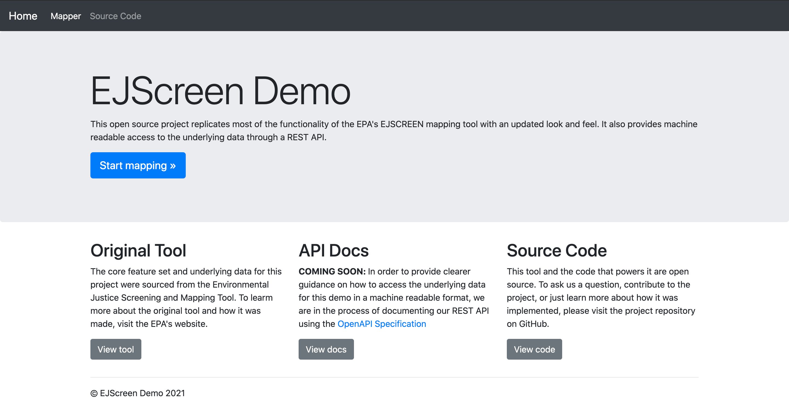

# EJScreen Demo

Updated example of EJScreen's tool

## Table of Contents

- [About this Project](#overview)
  - [Additional Resources](#additional-resources)
  - [Made With](#made-with)
- [Getting Started](#getting-started)
  - [Prerequisites](#prerequisites)
  - [Quick Installation](#quick-installation)
  - [Advanced Installation](#advanced-installation)
- [Usage](#usage)
  - [The App](#the-app)
  - [The API](#the-api)
- [Contributing](#contributing)

## About this Project



This tool provides a demonstration of an updated version of the EJScreen mapping tool, including an API to expose the EJScreen data in a machine readable format.

Below is a brief description of the current EJScreen tool pulled from its [home page](https://www.epa.gov/ejscreen):

> In order to better meet the Agency’s responsibilities related to the protection of public health and the environment, EPA has developed a new environmental justice (EJ) mapping and screening tool called EJSCREEN. It is based on nationally consistent data and an approach that combines environmental and demographic indicators in maps and reports.

To use the EPA's current version of the EJScreen tool and learn more about the underlying dataset, please refer to the links in the Additional Resources section below.

### Additional Resources

- [EJScreen Mapping Tool](https://ejscreen.epa.gov/mapper/)
- [Explanation of EJScreen Indicators](https://www.epa.gov/ejscreen/understanding-ejscreen-results)
- [Project Data Dictionary](docs/data-dictionary.md)

### Made With

- [flask](https://flask.palletsprojects.com/en/1.1.x/)
- [SQLAlchemy](https://www.sqlalchemy.org/)
- [flask restful](https://flask-restful.readthedocs.io/en/latest/)

## Getting Started

### Prerequisites

- Docker installed on your computer
- docker-compose installed on your computer

In order to check which version of python you have installed, run the following in your command line (for Mac/Linux)

> **NOTE:** in all of the code blocks below, lines preceded with `$` indicate commands you should enter in your command line (excluding the `$` itself), while lines preceded with `>` indicate the expected output from the previous command.

```
$ docker-compose -v && docker -v
> docker-compose version 1.28.5, build c4eb3a1f
> Docker version 20.10.5, build 55c4c88
```

If you don't have docker or docker-compose installed on your local machine, follow [these instructions to get docker](https://docs.docker.com/get-docker/)

### Quick Installation

1. Fork the repo following [these instructions](https://docs.github.com/en/github/getting-started-with-github/fork-a-repo)
1. Clone the forked repo on your local machine`git clone https://github.com/YOUR_USERNAME/ejscreen-demo.git`
1. Run `docker-compose up -d` from the command line to build and run docker containers for the app. Something similar to the following should be printed to the console:
   ```
   $ docker-compose up -d          
   > Creating network "ejscreen-demo_default" with the default driver
   > Creating volume "flask-test-db" with default driver
   > Creating volume "flask-app-db" with default driver
   > Creating postgrestest ... done
   > Creating postgres     ... done
   > Creating app          ... done
   ```
1. Wait 2-3 seconds after the apps are built, then run `docker-compose exec pytest` from the command line to execute the tests and ensure everything passes. Something similar to the following should be printed to the console:
   ```
   $ docker-compose exec pytest
   > =========================== test session starts ==========================
   > platform linux -- Python 3.7.10, pytest-6.2.2, py-1.10.0, pluggy-0.13.1
   > rootdir: /app
   > plugins: dash-1.19.0
   > collected 5 items
   >
   > tests/api/test_indicator.py .                                       [ 20%]
   > tests/api/test_indicator_score.py .                                 [ 40%]
   > tests/api/test_region.py .                                          [ 60%]
   > tests/common/test_get_ejscreen_data.py .                            [ 80%]
   > tests/common/test_setup.py .                                        [100%]
   >
   > ============================ 5 passed in 4.32s ============================
   ```

### Advanced Installation

1. Confirm that you have an python version 3.7 installed on your local machine
   ```
   $ python --version
   > Python 3.7.7  # should be something that starts with 3.7.x
   ```
1. Fork the repo following [these instructions](https://docs.github.com/en/github/getting-started-with-github/fork-a-repo)
1. Clone the forked repo on your local machine`git clone https://github.com/YOUR_USERNAME/ejscreen-demo.git`
1. Run `docker-compose up -d` to build and run the docker image of the app
1. Activate your virtual environment `source env/bin/activate`
1. Install necessary python packages`pip install -r requirements.txt`
1. Install pre-commit to enable pre-commit hooks (This step ensures that your code is formatted according the Black standard and is compliant with PEP8.)
   ```
   $ pre-commit install
   > pre-commit installed at .git/hooks/pre-commit
   ```
1. Run `docker-compose up -d` from the command line to build and run docker containers for the app. Something similar to the following should be printed to the console:
   ```
   $ docker-compose up -d          
   > Creating network "ejscreen-demo_default" with the default driver
   > Creating volume "flask-test-db" with default driver
   > Creating volume "flask-app-db" with default driver
   > Creating postgrestest ... done
   > Creating postgres     ... done
   > Creating app          ... done
   ```
1. Wait 2-3 seconds after the apps are built, then run `docker-compose exec pytest` from the command line to execute the tests and ensure everything passes. Something similar to the following should be printed to the console:
   ```
   $ docker-compose exec pytest
   > =========================== test session starts ==========================
   > platform linux -- Python 3.7.10, pytest-6.2.2, py-1.10.0, pluggy-0.13.1
   > rootdir: /app
   > plugins: dash-1.19.0
   > collected 5 items
   >
   > tests/api/test_indicator.py .                                       [ 20%]
   > tests/api/test_indicator_score.py .                                 [ 40%]
   > tests/api/test_region.py .                                          [ 60%]
   > tests/common/test_get_ejscreen_data.py .                            [ 80%]
   > tests/common/test_setup.py .                                        [100%]
   >
   > ============================ 5 passed in 4.32s ============================
   ```

## Usage

### The App

1. After you've cloned and installed the repo, run `docker-compose up -d` to start the app locally
1. Open a browser and go to [http://127.0.0.1:5000/](http://127.0.0.1:5000/) and you should see the home page with links to the original tool and the updated demo.
1. When you're done using or testing the API tear down the containers by running `docker-compose down --volumes`

### The API

1. After you've cloned and installed the repo, run `docker-compose up -d` to start the app locally
1. Open a browser and go to [http://127.0.0.1:5000/api/indicators](http://127.0.0.1:5000/api/indicators) and you should the JSON of all of the indicators in the database.
1. Go to [http://127.0.0.1:5000/api/regions](http://127.0.0.1:5000/api/regions) and you should get the JSON of the first 10 regions from the EJSCREEN source data
1. When you're done using or testing the app tear down the containers by running `docker-compose down --volumes`

## Contributing

Details on contributing to the project TBD
